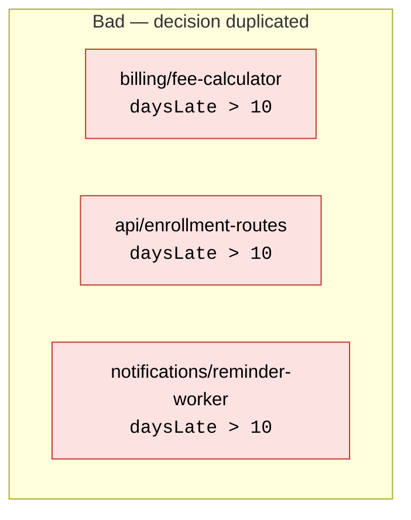
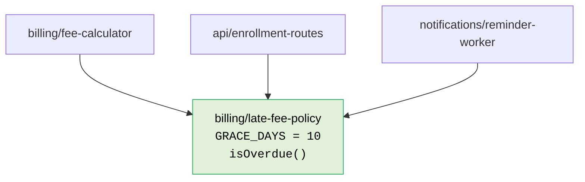

# Readiness for Change

> The quality of our code is measured by how ready it is for change.

This is the north star. Every other rule in these standards exists to serve it. When a rule and this sentence disagree, this sentence wins.

## The metric

A requirement is never final. It will be added to, refined, reversed. So the question that defines quality is not "is this code clean?" but:

> When this requirement changes, how many places must I edit?

That count is the **change-surface** of the requirement. Lower is better, down to the irreducible minimum the problem itself imposes. Code is high quality when a single conceptual change maps to a single, obvious, local edit — and low quality when one conceptual change forces edits scattered across many files, layers, and authors.

This is not a metaphor. You can measure it. Pick a representative change ("the late-fee grace period moves from 10 days to 14", "we add a third user role", "billing moves from one provider to another") and count the files that must change. If the count is larger than the idea, the code is in the wrong shape.

## The named failure mode: change amplification

When a conceptually small change requires edits in many places, you have **change amplification** (Ousterhout, *A Philosophy of Software Design*). It is the single most reliable symptom of a bad decomposition. Its causes are always one of a short list:

- **Duplicated decisions.** The same rule is expressed in more than one place, so every change must find and update every copy — and missing one is a bug.
- **Decisions tangled with I/O.** A rule that lives inside a database query or an HTTP handler can only change by editing transport code, and can only be tested by standing up transport.
- **A discriminator branched on in N places.** When `type === 'x'` (or its equivalent) drives behavior in three different functions, adding a new type means editing all three and hoping you found them all. This has its own principle — see [Single Choice](06-single-choice.md).
- **Leaked implementation details.** When a module exposes how it works rather than what it decides, every caller is coupled to the mechanism, so changing the mechanism changes every caller.

The rest of these standards are, almost entirely, named defenses against these four causes.

## The deeper principle: decompose by what changes

The foundational statement is Parnas (1972), *On the Criteria To Be Used in Decomposing Systems into Modules*: **a module should hide a decision that is likely to change.** Do not decompose by the steps a process happens to run through (parse, then validate, then save); decompose by the things that vary independently (the storage format, the validation rules, the wire protocol). When you draw boundaries around what changes, a change stays inside one boundary.

Robert Martin's Single Responsibility Principle is the same idea stated from the other side: **a module should have one reason to change** — one actor, one stakeholder, one axis of variation. If two unrelated requirements can both force you to edit the same function, that function is doing two jobs and should be split.

## What this means in practice

- Before writing a function, ask what decision it owns and what would make that decision change. If you cannot name a single such reason, the function is doing too much.
- Prefer a shape where adding a new case means **adding** code, not **editing** existing code (open for extension, closed for modification). A lookup table you add a row to beats a conditional you add a branch to.
- Treat duplication of a *decision* as a defect even when the duplicated lines look harmless. Two copies of a rule are two places a future change can be missed.

## What this is not

This is not an aesthetic standard, and it is not about cleverness or brevity. Every syntactic and structural rule in the dialect documents earns its place by either **reducing change-surface** or **reducing the chance of a silent error** — not by taste. If you ever cannot trace a rule back to one of those two justifications, question the rule, not your judgment.

## Examples

The defining question is "when this requirement changes, how many places must I edit?" The 10-day late-fee grace period is not used in one place — it is consulted by three *different parts of the system*, each owned by a different team: the billing engine that charges the fee, the enrollment API that blocks re-enrollment while overdue, and the nightly worker that emails reminders. The change-surface is decided by whether those three parts *share* the decision or each *re-derive* it.

**Bad — every consumer re-derives the rule, so the decision is smeared across three modules in three layers.** This is not three lines in one file; it is the same business rule independently re-stated in a [Transformation](02-layers.md), at an API [edge](02-layers.md), and in a background [Effect](02-layers.md). Nothing links them, so nothing keeps them in agreement.

<CodeToggle>
<template #csharp>

```csharp
// Billing/FeeCalculator.cs  (domain — Transformation)
public static decimal CalculateLateFee(int daysLate, decimal balance) =>
    daysLate > 10 ? balance * 0.05m : 0m;

// Api/EnrollmentEndpoints.cs  (transport edge — gate re-enrollment)
app.MapPost("/enroll", (EnrollmentRequest request) =>
    request.DaysLate > 10
        ? Results.Conflict("Account is overdue.")
        : Enroll(request));

// Notifications/ReminderWorker.cs  (background Effect — copy #3)
private static string ReminderBody(int daysLate) =>
    daysLate > 10
        ? "A late fee has been applied."
        : "Your payment is overdue.";
```

</template>
<template #ts>

```typescript
// billing/fee-calculator.ts  (domain — Transformation)
export const calculateLateFee = (daysLate: number, balance: number) =>
  daysLate > 10
    ? balance * 0.05
    : 0

// api/enrollment-routes.ts  (transport edge — gate re-enrollment)
const enroll = ({ daysLate, ...request }: EnrollmentRequest, reply: Reply) =>
  daysLate > 10
    ? reply.status(409).send({ error: 'Account is overdue.' })
    : reply.send(enrollStudent(request))

// notifications/reminder-worker.ts  (background Effect — copy #3)
const reminderBody = (daysLate: number) =>
  daysLate > 10
    ? 'A late fee has been applied.'
    : 'Your payment is overdue.'
```

</template>
</CodeToggle>

The literal `10` and the `>` comparison are the *same decision* living in three modules that never reference each other:



**Good — one module owns the decision; the three consumers depend on it.** The grace period and the "is this account overdue?" predicate live in a single domain policy. The billing engine, the API edge, and the worker all import it. There is now exactly one place the rule can be wrong, and one place it can be changed.

<CodeToggle>
<template #csharp>

```csharp
// Billing/LateFeePolicy.cs  (domain — the single owner)
public static class LateFeePolicy
{
    public const int GraceDays = 10;

    public static bool IsOverdue(int daysLate) => daysLate > GraceDays;

    public static decimal Fee(int daysLate, decimal balance) =>
        IsOverdue(daysLate) ? balance * 0.05m : 0m;
}

// Api/EnrollmentEndpoints.cs        -> LateFeePolicy.IsOverdue(request.DaysLate)
// Notifications/ReminderWorker.cs   -> LateFeePolicy.IsOverdue(daysLate)
```

</template>
<template #ts>

```typescript
// billing/late-fee-policy.ts  (domain — the single owner)
export const LATE_FEE_GRACE_DAYS = 10

export const isOverdue = (daysLate: number) => daysLate > LATE_FEE_GRACE_DAYS

export const lateFee = (daysLate: number, balance: number) =>
  isOverdue(daysLate)
    ? balance * 0.05
    : 0

// api/enrollment-routes.ts      -> isOverdue(request.daysLate)
// notifications/reminder-worker -> isOverdue(daysLate)
```

</template>
</CodeToggle>



### Worked scenario: the grace period moves from 10 to 14 days

Compliance changes the grace period to 14 days. This is one conceptual change. Trace where the edits land in each shape.

**In the bad shape**, the requirement fans out into a multi-file, multi-team pull request — and the reviewer's only completeness check is "did we catch every `10`?":

```diff
  // billing/fee-calculator
- daysLate > 10 ? balance * 0.05 : 0
+ daysLate > 14 ? balance * 0.05 : 0

  // api/enrollment-routes
- request.daysLate > 10
+ request.daysLate > 14

  // notifications/reminder-worker  ← the one a hurried PR forgets
- daysLate > 10
+ daysLate > 14
```

Miss the third edit and nothing crashes: the fee engine and the API now agree the account is fine on day 12, but the worker still emails "a late fee has been applied." A customer is told they owe a fee the system never charged — a silent, cross-system contradiction that can live in production for months because no test exercises all three modules together.

**In the good shape**, the change is one line in the module that owns the decision; every consumer moves with it because none of them ever held a copy:

```diff
  // billing/late-fee-policy
- export const LATE_FEE_GRACE_DAYS = 10
+ export const LATE_FEE_GRACE_DAYS = 14
```

The change-surface equals the size of the idea — one number, one edit — which is exactly what [decomposing by what changes](#the-deeper-principle-decompose-by-what-changes) buys you. The naming and the single-owner discipline were never cosmetic: they are the reason a one-line requirement stays a one-line change instead of a three-team scavenger hunt.

## Where to go next

- [Layers](02-layers.md) — the primary tool for keeping a change inside one boundary.
- [Where does this go?](03-where-does-this-go.md) — the decision procedure that places new code in the right layer the first time.
- [Information hiding](04-information-hiding.md) — how to draw the boundaries themselves.
- [Single choice](06-single-choice.md) — the defense against a discriminator scattered across many branch sites.
