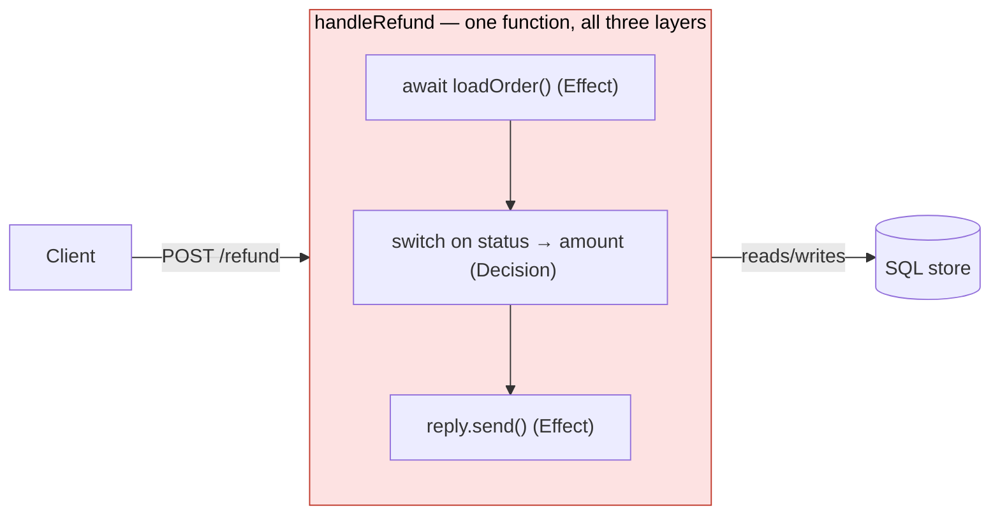
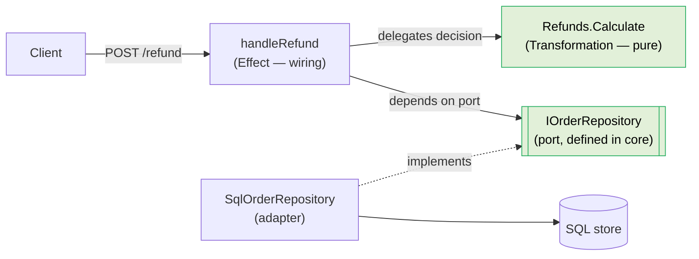
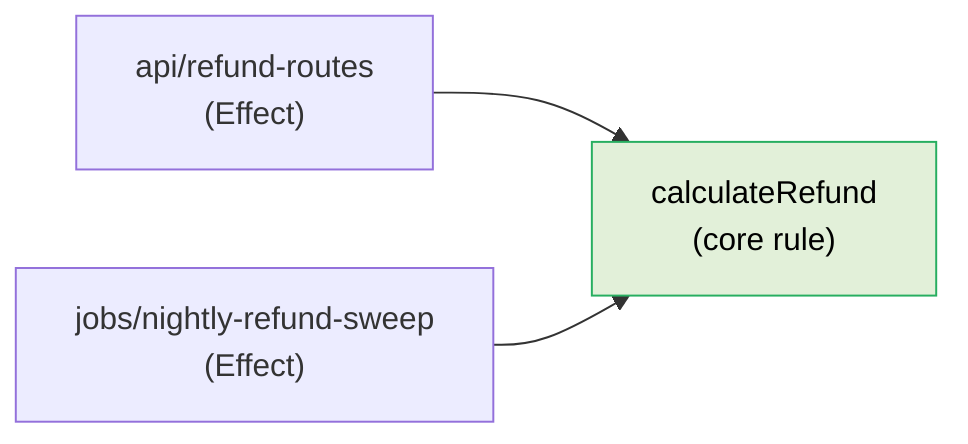
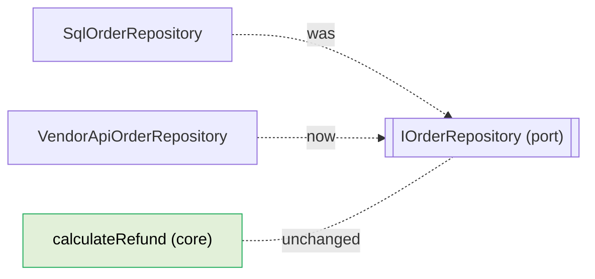

# Layers

Layering is how we keep a change inside one boundary. It is the primary mechanism by which we deliver [readiness for change](01-readiness-for-change.md). There are two axes, and they are orthogonal — every piece of code has a position on both.

## Axis 1 — Data / Transformation / Effect

Every line of code is one of three kinds. If you cannot say which in one word, the code is doing too much; split it.

### Data — decisions as values
Lookup maps, configuration objects, route tables, rule sets. A decision expressed as an inert, inspectable value rather than as control flow. Data has no behavior; you can print it, diff it, and test it by reading it. Pushing decisions into data is the strongest defense against "a discriminator branched on in N places" — adding a case becomes adding a row.

### Transformation — pure functions
Input in, output out. No I/O, no mutation of external state, no reading of ambient state (clock, randomness, environment, global refs). A transformation's output depends only on its arguments, which means it is trivially testable and trivially movable. This is where business *derivation* lives — the calculations and decisions that define what the domain means.

### Effect — side effects at the boundary
Database reads and writes, HTTP, filesystem, S3/blob storage, the DOM, the clock, randomness. Effects are where the program touches the outside world. They must be **thin wiring**: fetch inputs, hand them to transformations, take the result, perform the output. 

> **The load-bearing rule:** if a function contains `await` (or otherwise performs I/O), it is an Effect, and it must contain **no domain decisions** — no rule logic, no branching on domain values, no calculation. It delegates every decision to a transformation. A function that queries the database, decides something, and writes a response has collapsed all three layers into one, and now any change to any of the three forces you to read and re-test the other two.

## Axis 2 — Business core vs transport/IO edge

The second axis is about *dependency direction*. This is the **Dependency Rule** (Martin, *Clean Architecture*) and the heart of **Hexagonal / Ports & Adapters** (Cockburn) and **Onion Architecture** (Palermo):

- The **business core** holds the rules that define the domain — what an enrollment is, when a fee applies, how a grade is computed. The core knows nothing about HTTP, SQL, the filesystem, the UI framework, or any specific vendor. It depends on nothing outward.
- The **transport/IO edge** holds the delivery and persistence mechanisms — REST controllers, GraphQL resolvers, database repositories, message consumers, UI components. The edge depends **inward** on the core. The core never depends outward on the edge.

Dependencies point in one direction only: from the edge toward the core. The core defines interfaces (ports); the edge implements them (adapters).

## Why this serves readiness for change

The two axes partition changes so that they don't entangle:

- A **delivery-mechanism change** — REST to GraphQL, Postgres to another store, one blob vendor to another — touches only the edge. The core does not move because the core never knew which mechanism it had.
- A **business-rule change** — a new fee policy, a new role, a new grading curve — touches only the core (usually a single transformation or a single data table). No transport code moves, because transport held no rules.
- A change to **how a decision is represented as data** (a new strategy variant) is an addition to a data structure, not an edit to control flow spread across the edge.

When the layers are clean, the change-surface of any requirement collapses to the smallest set the problem allows. When they collapse together, every change is a whole-stack change.

## The collapse anti-pattern

The recurring failure is a single function that reads from a store, applies a rule, and emits a response — domain logic living inside an I/O boundary. It cannot be tested without the I/O, it cannot be reused by another delivery path, and a change to the rule is indistinguishable from a change to the transport. Whenever you see `await` sitting in the same function body as a domain conditional or a calculation, you are looking at a collapsed layer. Lift the decision into a transformation and leave only wiring behind.

## Examples

The load-bearing rule is that a function with `await` in it holds **no domain decision**. In isolation that sounds like a code-style preference. It is not: it is what decides whether a rule change and a transport change can touch each other.

**Bad — the collapse.** One handler reads from the store, decides the refund amount, and writes the response. All three layers live in one function body, so the diagram of this feature is a single box straddling the boundary:



The refund *rule* is trapped inside an HTTP boundary: you cannot test it without standing up a request, you cannot reuse it from a batch job, and a change to the rule is indistinguishable in the diff from a change to the transport.

<CodeToggle>
<template #csharp>

```csharp
// Api/RefundEndpoints.cs — Effect, Decision, and storage all in one body
app.MapPost("/orders/{orderId:int}/refund",
    async (int orderId, IOrderRepository orders) =>
    {
        var order = await orders.FindAsync(orderId);

        // domain decision tangled inside the Effect
        var refund = order.Status switch
        {
            "shipped"   => order.Total * 0.5m,
            "delivered" => 0m,
            _           => order.Total,
        };

        return Results.Ok(new { refund });
    });
```

</template>
<template #ts>

```typescript
// api/refund-routes.ts — Effect, Decision, and storage all in one body
const handleRefund = async ({ params: { orderId } }: Request, reply: Reply) => {
  const order = await loadOrder(orderId)

  // domain decision tangled inside the Effect
  const refund = order.status === 'shipped'
    ? order.total * 0.5
    : order.status === 'delivered'
      ? 0
      : order.total

  return reply.send({ refund })
}
```

</template>
</CodeToggle>

**Good — the decision moves to a Transformation in the core; the edge becomes wiring.** Now the feature is three boxes with one-way dependencies. The handler depends inward on the pure rule and on a *port* (`IOrderRepository`); the SQL adapter implements that port. The arrows only ever point toward the core:



<CodeToggle>
<template #csharp>

```csharp
// Domain/Refunds.cs — Transformation, pure, no I/O
public static class Refunds
{
    public static decimal Calculate(Order order) => order.Status switch
    {
        "shipped"   => order.Total * 0.5m,
        "delivered" => 0m,
        _           => order.Total,
    };
}

// Api/RefundEndpoints.cs — Effect, thin wiring, no domain decision
app.MapPost("/orders/{orderId:int}/refund",
    async (int orderId, IOrderRepository orders) =>
    {
        var order = await orders.FindAsync(orderId);

        return Results.Ok(new { refund = Refunds.Calculate(order) });
    });
```

</template>
<template #ts>

```typescript
// domain/refunds.ts — Transformation, pure, no I/O
export const calculateRefund = ({ status, total }: Order) =>
  status === 'shipped'
    ? total * 0.5
    : status === 'delivered'
      ? 0
      : total

// api/refund-routes.ts — Effect, thin wiring, no domain decision
const handleRefund = async ({ params: { orderId } }: Request, reply: Reply) => {
  const order = await loadOrder(orderId)

  return reply.send({ refund: calculateRefund(order) })
}
```

</template>
</CodeToggle>

### Worked scenario: two new demands hit both axes

The split looks like ceremony until two requests arrive — one on each axis — that the collapsed version cannot absorb cheaply.

**Demand 1 (business reuse): finance wants a nightly job that recomputes refunds for a batch of orders — no HTTP.** With the rule already lifted into `calculateRefund`, the new Effect is a second-thin wiring that reuses the *same* core function. Both delivery paths now point at one rule:



<CodeToggle>
<template #csharp>

```csharp
// Jobs/NightlyRefundSweep.cs — new Effect, same core rule
public async Task RunAsync(CancellationToken ct)
{
    var orders = await _orders.PendingRefundsAsync(ct);

    foreach (var order in orders)
        await _ledger.RecordRefundAsync(order.Id, Refunds.Calculate(order), ct);
}
```

</template>
<template #ts>

```typescript
// jobs/nightly-refund-sweep.ts — new Effect, same core rule
const runNightlyRefundSweep = async () => {
  const orders = await loadPendingRefundOrders()

  await Promise.all(
    orders.map((order) => recordRefund(order.id, calculateRefund(order))),
  )
}
```

</template>
</CodeToggle>

In the collapsed shape this is impossible without harm: the job would either call the HTTP handler (dragging in `Request`/`Reply` it has no use for) or paste a second copy of the `switch` — a [duplicated decision](01-readiness-for-change.md) that will drift the first time refund rates change.

**Demand 2 (delivery change): orders migrate from SQL to a vendor API.** This touches only the [Effect edge](#effect-side-effects-at-the-boundary). A new adapter implements the existing `IOrderRepository` port; the core and both Effects above are untouched, because none of them ever knew which store backed the port.



In the collapsed version the query and the rule share a function body, so a storage swap forces you to re-read and re-test the refund logic for no reason — a whole-stack change for an edge-only requirement. That is exactly the entanglement the two axes exist to prevent: **business-rule changes stay in the core, delivery changes stay at the edge, and neither drags the other along.**

## Where to go next

- [Where does this go?](03-where-does-this-go.md) — the procedure for placing new code on both axes.
- [Information hiding](04-information-hiding.md) — how to decide where the boundaries between modules fall.
- Your language's dialect — how these layers are spelled in [TypeScript](../dialects/typescript.md) or [C#](../dialects/csharp.md).
