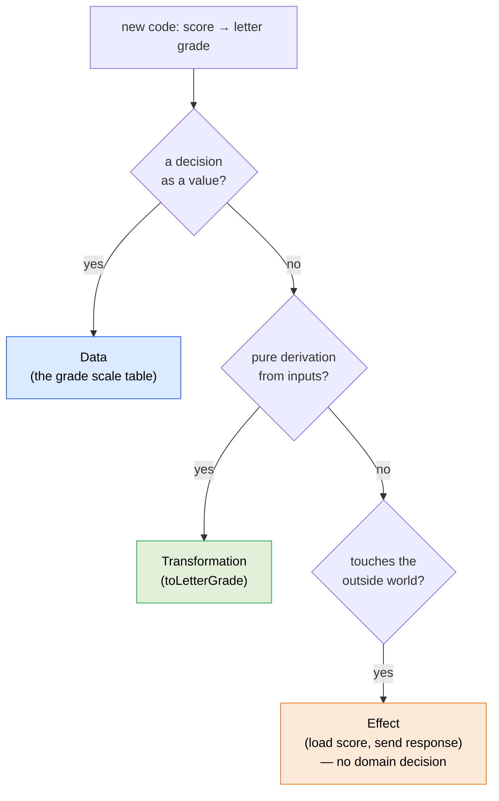
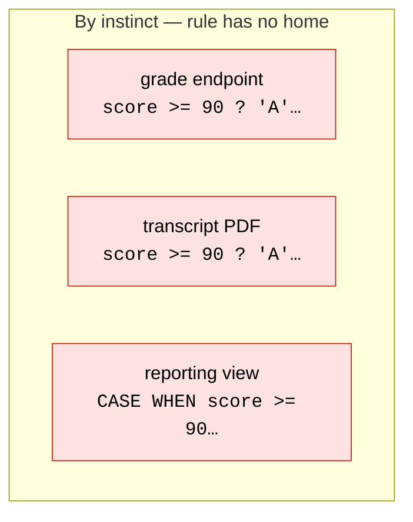
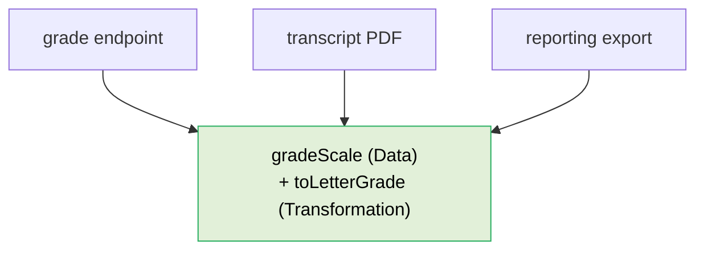

# Where Does This Go?

This is the most-asked question on any team, and the answer is usually a judgment call that two engineers answer two different ways. That inconsistency *is* change-amplification in slow motion: code accretes in the wrong places, and later changes pay for it. This document turns the question into a procedure that a junior engineer and a reviewer answer the same way.

Run it for every new piece of code, before you write it.

## The procedure

Answer in order. The first "yes" places the code.

**1. Is it a decision expressed as a value?**
A lookup map, a config object, a route table, a set of rules with no behavior of their own. If you could write it down as a table and read the answer off it → **[Data](02-layers.md)**.

**2. Is it a pure derivation?**
Does it compute an output purely from its inputs — no database, no network, no filesystem, no DOM, no clock, no randomness, no reading or mutating external state? If output depends only on arguments → **[Transformation](02-layers.md)**.

**3. Does it touch the outside world?**
Database, network, filesystem, object storage, DOM, environment, time, randomness. If yes → **[Effect](02-layers.md)** — and now apply the constraint: it must hold **no domain decisions**. Any rule, calculation, or branch on a domain value gets lifted out into a Transformation (step 2) and called from here. The Effect is wiring only.

Then, independently, the dependency-direction question:

**4. Is it a business rule or a delivery concern?**
- A statement about what the **domain** means — when a fee applies, what a valid enrollment is, how a score maps to a grade → it belongs in the **business core**, in a module that imports no transport, no ORM, no framework, no vendor SDK.
- A statement about **how** something is transported, stored, or rendered — this endpoint's shape, this table's columns, this component's markup → it belongs at the **transport/IO edge**, which may depend inward on the core but never the reverse.

## Reviewer checklist

A reviewer (human or automated) can run this against any diff:

- [ ] Does any function contain both `await`/I/O **and** a domain decision (a branch on a domain value, a calculation, a rule)? → layer collapse; lift the decision out.
- [ ] Is the same decision expressed in more than one place? → duplicated decision; extract to one Transformation or one Data table.
- [ ] Does a discriminator (`type`, `status`, `role`, `kind`) drive behavior in three or more places? → extract a strategy/lookup keyed by the discriminator ([Single Choice](06-single-choice.md)).
- [ ] Does a core/domain module import a framework, ORM, HTTP client, or vendor SDK? → dependency-rule violation; invert it behind a port.
- [ ] Can you name this function's single reason to change in one phrase? → if not, split it.

## The one-word test

If you cannot answer "which layer is this — Data, Transformation, or Effect?" with a single word, the unit is doing more than one job. Split it until each piece has a one-word answer. The split is almost never wasted: the pure part becomes testable and reusable, and the I/O part shrinks to wiring you barely have to think about.

## Examples

A new requirement arrives: *compute a student's letter grade from their numeric score*. Run it through the procedure — the first "yes" places each part:



The single feature decomposes into one part per layer. Now contrast the two ways it gets built.

**Bad — placed by instinct, not procedure.** It landed wherever the work happened to start: inside the endpoint that needed it. The endpoint now touches the outside world (`await`) **and** owns a domain rule (the score-to-letter mapping). Step 3 of the procedure forbids exactly this. The mapping cannot be tested without a request, and the next endpoint that needs a letter grade will copy the thresholds.

<CodeToggle>
<template #ts>

```typescript
const handleGrade = async ({ params: { studentId } }: Request, reply: Reply) => {
  const score = await loadFinalScore(studentId)

  // a domain rule, stranded inside an Effect
  const letter = score >= 90
    ? 'A'
    : score >= 80
      ? 'B'
      : score >= 70
        ? 'C'
        : 'F'

  return reply.send({ letter })
}
```

</template>
<template #csharp>

```csharp
app.MapGet("/students/{studentId:int}/grade",
    async (int studentId, IScoreRepository scores) =>
    {
        var score = await scores.FinalScoreAsync(studentId);

        // a domain rule, stranded inside an Effect
        var letter = score switch
        {
            >= 90 => "A",
            >= 80 => "B",
            >= 70 => "C",
            _     => "F",
        };

        return Results.Ok(new { letter });
    });
```

</template>
</CodeToggle>

**Good — placed by the procedure.** Step 1: the thresholds are a decision expressible as a value → **Data**. Step 2: turning a score into a letter is a pure derivation → **Transformation**. Step 3: fetching the score touches the outside world → **Effect**, holding no decision. Step 4: the grade scale is a statement about what the *domain* means → it lives in the business core, importing no transport.

<CodeToggle>
<template #ts>

```typescript
// Data — the scale, an inspectable value
const gradeScale = [
  { min: 90, letter: 'A' },
  { min: 80, letter: 'B' },
  { min: 70, letter: 'C' },
  { min: 0, letter: 'F' },
] as const

// Transformation — pure derivation
const toLetterGrade = (score: number) =>
  gradeScale.find(({ min }) => score >= min)?.letter ?? 'F'

// Effect — wiring only
const handleGrade = async ({ params: { studentId } }: Request, reply: Reply) => {
  const score = await loadFinalScore(studentId)

  return reply.send({ letter: toLetterGrade(score) })
}
```

</template>
<template #csharp>

```csharp
// Data — the scale, an inspectable value
public static class GradeScale
{
    public static readonly IReadOnlyList<(int Min, string Letter)> Bands =
    [
        (90, "A"),
        (80, "B"),
        (70, "C"),
        (0, "F"),
    ];
}

// Transformation — pure derivation
public static class Grades
{
    public static string ToLetter(int score) =>
        GradeScale.Bands.First(band => score >= band.Min).Letter;
}

// Effect — wiring only
app.MapGet("/students/{studentId:int}/grade",
    async (int studentId, IScoreRepository scores) =>
    {
        var score = await scores.FinalScoreAsync(studentId);

        return Results.Ok(new { letter = Grades.ToLetter(score) });
    });
```

</template>
</CodeToggle>

### Worked scenario: a third consumer arrives, then the scale changes

Asked "where does the grade calculation go?", two engineers answering by taste give two answers — one inlines it in the controller, one tucks it into a SQL view. The cost shows up later, when a *third* consumer needs the same rule.

Six months on, a transcript-PDF feature also needs letter grades. In the by-instinct codebase the rule is buried in an HTTP handler (or a DB view), so the PDF generator — which has no HTTP context — grows its own third copy of the thresholds. Now three modules each own the scale:



Run mechanically, steps 1–3 force *every* engineer to extract the scale to Data and the mapping to a Transformation, so all three consumers converge on one rule:



So when the school adds a **B+** band, the by-instinct codebase is a three-file hunt with a silent-divergence risk (the registrar's report disagreeing with the API), while the procedure-placed codebase is one new row and zero call-site edits:

<CodeToggle>
<template #csharp>

```diff
  public static readonly IReadOnlyList<(int Min, string Letter)> Bands =
  [
      (90, "A"),
+     (87, "B+"),
      (80, "B"),
      (70, "C"),
      (0, "F"),
  ];
```

</template>
<template #ts>

```diff
  const gradeScale = [
    { min: 90, letter: 'A' },
+   { min: 87, letter: 'B+' },
    { min: 80, letter: 'B' },
    { min: 70, letter: 'C' },
    { min: 0, letter: 'F' },
  ] as const
```

</template>
</CodeToggle>

The point of being this mechanical is not tidiness — it is that a predictable placement makes the next change land in the one obvious place, for whoever shows up to make it.

## Why bother being this mechanical

Because consistency is the whole point. If everyone places code the same way, then everyone *finds* code the same way, and a future change lands in the one obvious place. A procedure that removes judgment from "where does this go" is what makes the change-surface predictable — and a predictable change-surface is [readiness for change](01-readiness-for-change.md).
