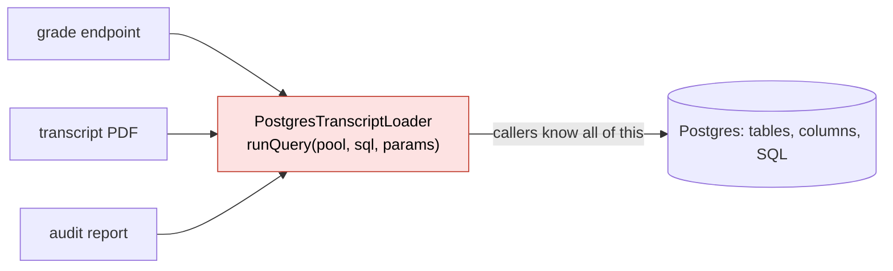
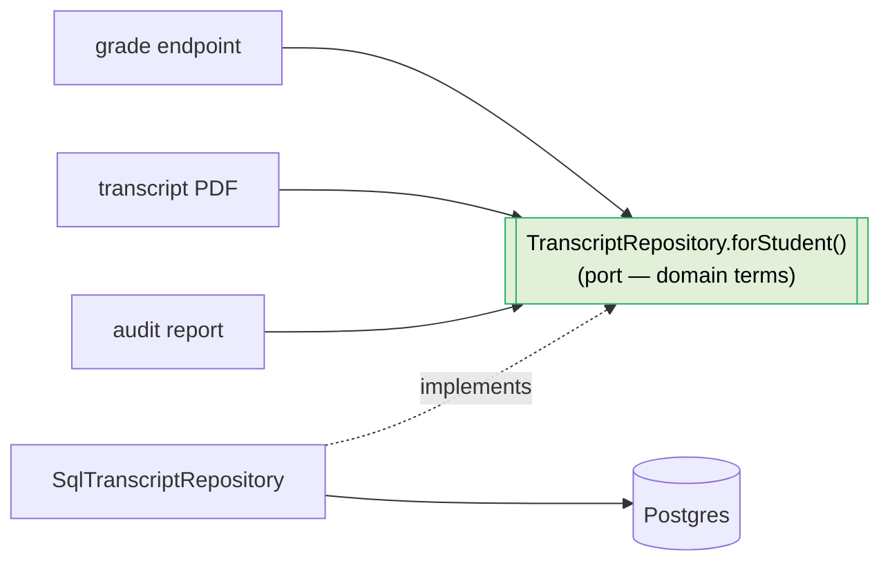
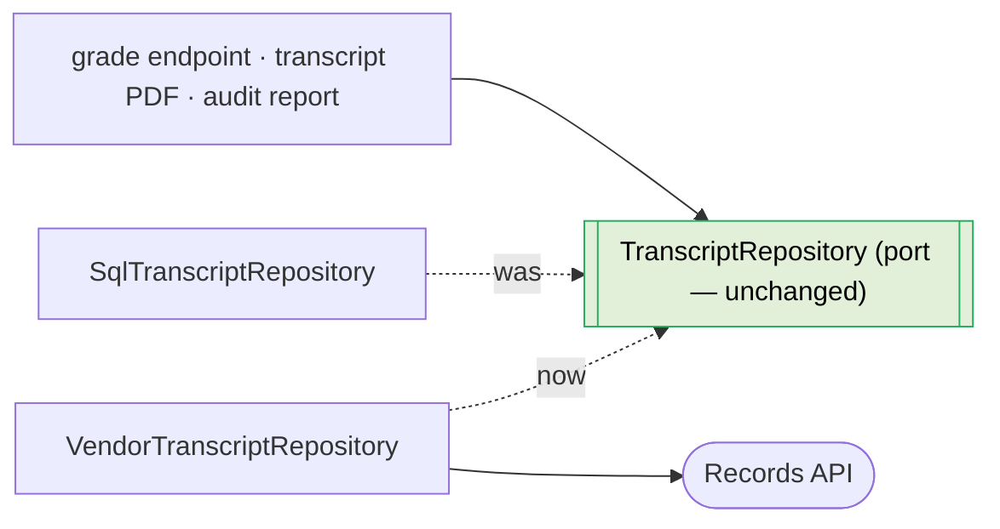

# Information Hiding

[Layers](02-layers.md) tell you the *kind* of each piece of code. Information hiding tells you where to draw the boundaries *between* modules — and getting those boundaries right is what keeps a change from leaking across them.

## Decompose by what changes, not by what happens

The instinct is to split a system by the steps it performs: a parsing module, a validation module, a saving module. Parnas (1972) showed this is usually wrong. Decompose instead by **the decisions that are likely to change independently**, and hide each one inside a module. The test is not "what does this code do?" but "what decision does this module hide, and what would make that decision change?"

When boundaries follow changeability, a change stays inside one module. When boundaries follow process steps, a single change (say, a new storage format) cuts across parsing, validation, and saving all at once — change amplification by construction.

## Deep modules over shallow ones

A **deep module** (Ousterhout) has a simple interface hiding a substantial implementation: callers learn a little and get a lot, and the implementation can be rewritten without touching a single caller. A **shallow module** exposes nearly as much as it hides — a thin pass-through, a wrapper that leaks its internals — and earns its keep poorly because changing it changes everyone.

Prefer interfaces that are narrow relative to the complexity they conceal. Ask of every module:

> What does this hide? If the answer is "nothing," why does it exist?

## One reason to change

A module should have **one reason to change** — one stakeholder or axis of variation that drives its evolution. If a billing rule change and a report-formatting change both force edits to the same module, it has two responsibilities and two reasons to change; split it so each change has its own home. Conversely, things that always change *together* belong together; splitting them just spreads one change across two files.

## The leak test

The sharpest practical question:

> If an implementation detail changes, does the module's *interface* change, or only its *implementation*?

If a purely internal change (a different algorithm, a different storage layout, a different vendor) forces the interface to change, then that detail is **leaking** through the boundary, and every caller is coupled to it. A good boundary lets the implementation churn freely while the interface holds still. This is exactly the Ports & Adapters discipline from [Layers](02-layers.md): the core defines a port in terms of the domain, and the adapter hides the mechanism behind it.

## Name the boundary by what it decides

Name a module, interface, or function for the decision it owns or the intent it serves — not for the mechanism it currently uses. `GradeCalculator` survives a rewrite; `PostgresGradeLoader` advertises its mechanism and becomes a lie the day the mechanism changes. Naming for intent keeps the name stable across exactly the changes we are trying to be ready for. (Casing and language specifics live in the dialect docs; the principle is *meaning over mechanism*.)

## Examples

The sharpest test is the leak test: *if an implementation detail changes, does the module's interface change, or only its implementation?* A module that needs to load a student's transcript is the example.

**Bad — a shallow module that leaks its mechanism.** The interface is named for *how* it works and shaped around the storage technology: callers pass connection details and SQL-flavored arguments, so they are coupled to the fact that this is a Postgres query today. The day the data moves to a vendor API, the interface — and every caller — changes. The module hides almost nothing; it is a thin pass-through that advertises its internals.

<CodeToggle>
<template #ts>

```typescript
// name and shape both leak "this is SQL on Postgres"
interface PostgresTranscriptLoader {
  runQuery: (
    pool: ConnectionPool,
    sql: string,
    params: unknown[],
  ) => Promise<Row[]>
}

// every caller knows the table, the columns, and that it's SQL
const rows = await loader.runQuery(
  pool,
  'select term, course_id, grade from transcripts where student_id = $1',
  [studentId],
)
```

</template>
<template #csharp>

```csharp
// name and shape both leak "this is SQL on Postgres"
public interface IPostgresTranscriptLoader
{
    Task<IReadOnlyList<Row>> RunQueryAsync(
        NpgsqlConnection connection,
        string sql,
        object[] parameters);
}

// every caller knows the table, the columns, and that it's SQL
var rows = await loader.RunQueryAsync(
    connection,
    "select term, course_id, grade from transcripts where student_id = @id",
    [studentId]);
```

</template>
</CodeToggle>

Because the SQL string and `ConnectionPool` are *in the interface*, every caller is coupled straight through the "module" to Postgres — the boundary hides nothing:



**Good — a deep module named for the decision it owns.** The interface speaks the domain (`Transcript` for a student) and hides everything about *how* it is fetched. Callers learn a little and get a lot; the implementation can be a Postgres query, a vendor API, or an in-memory fake, and not one caller changes.

<CodeToggle>
<template #ts>

```typescript
// the port: named for intent, shaped in domain terms
interface TranscriptRepository {
  forStudent: (studentId: string) => Promise<Transcript>
}

// the caller knows nothing about storage
const transcript = await transcripts.forStudent(studentId)
```

</template>
<template #csharp>

```csharp
// the port: named for intent, shaped in domain terms
public interface ITranscriptRepository
{
    Task<Transcript> ForStudentAsync(string studentId);
}

// the caller knows nothing about storage
var transcript = await transcripts.ForStudentAsync(studentId);
```

</template>
</CodeToggle>

Here the same callers depend only on the domain-shaped port; everything about storage lives behind it, in a swappable adapter:



### Worked scenario: the storage vendor changes

The migration that always eventually happens: transcripts move out of Postgres into a third-party records API. This is a *purely internal* change — only *how* a transcript is fetched — and the leak test predicts the blast radius.

With the shallow `PostgresTranscriptLoader`, the SQL string and `ConnectionPool` are in the interface, so the API has no equivalent to pass. The interface itself must change, and every caller changes with it — the [change-surface](01-readiness-for-change.md) of "swap the vendor" balloons across the whole codebase. The module hid nothing, so it protected nothing.

With the deep `TranscriptRepository`, the migration is **one new file** implementing the unchanged port, plus a one-line swap at the [composition root](02-layers.md). The core and all three callers hold still:

<CodeToggle>
<template #csharp>

```csharp
// NEW FILE: Infrastructure/VendorTranscriptRepository.cs
public sealed class VendorTranscriptRepository(IRecordsApiClient api) : ITranscriptRepository
{
    public async Task<Transcript> ForStudentAsync(string studentId)
    {
        var record = await api.GetAcademicRecordAsync(studentId);
        return TranscriptMapper.FromVendor(record);
    }
}

// Program.cs — the only edit at the composition root
- builder.Services.AddScoped<ITranscriptRepository, SqlTranscriptRepository>();
+ builder.Services.AddScoped<ITranscriptRepository, VendorTranscriptRepository>();
```

</template>
<template #ts>

```typescript
// NEW FILE: infrastructure/vendor-transcript-repository.ts
export const vendorTranscriptRepository = (
  api: RecordsApiClient,
): TranscriptRepository => ({
  forStudent: async (studentId) =>
    fromVendorRecord(await api.getAcademicRecord(studentId)),
})

// composition root — the only edit
- const transcripts = sqlTranscriptRepository(pool)
+ const transcripts = vendorTranscriptRepository(recordsApi)
```

</template>
</CodeToggle>

The new adapter slots in behind the unchanged port:



This is the Ports & Adapters discipline from [Layers](02-layers.md) made concrete: the boundary lets the implementation churn freely while the interface stays put. And the [naming](05-naming.md) did real work — `TranscriptRepository` survived the rewrite that would have turned `PostgresTranscriptLoader` into a lie.

## Where to go next

- [Naming](05-naming.md) — names as a change-surface concern.
- [Where does this go?](03-where-does-this-go.md) — placing code once the boundaries exist.
