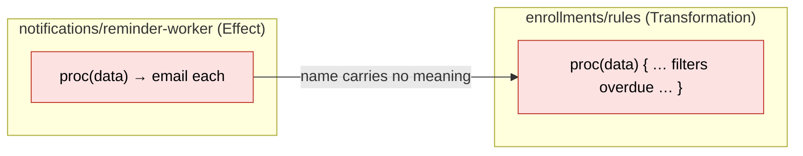

# Naming

Names are a change-surface concern, not a cosmetic one. A vague name forces every future reader to re-derive intent from the implementation before they can safely change it — and a reader who guesses wrong introduces a bug. A precise name is a cached decision: it tells the next person what this is *for* so they can change it without reverse-engineering it.

These are language-agnostic principles. Casing conventions (camelCase, PascalCase, snake_case) are a dialect concern and live in the per-language docs; what follows is about *meaning*, which is portable.

## Name for intent, not mechanism or type

Name a thing for the role it plays in the domain, not for how it is currently implemented or what type it happens to be. `enrollmentDeadline` survives a refactor; `dateField2` never told you anything and `timestampLong` will lie the moment the representation changes. Naming for intent keeps names stable across exactly the changes we want to be ready for — see [information hiding](04-information-hiding.md).

## Boolean names are yes/no questions

Any name that holds a boolean should read as a question with an obvious yes/no answer. Use a predicate prefix:

`is`, `has`, `can`, `should`, `was`, `did`, `are`, `have`.

`isActive`, `hasOutstandingBalance`, `canEnroll`, `shouldRetry`. A boolean called `active` or `enrollment` forces the reader to discover its type before they can read the logic; a predicate prefix makes the conditional read like prose.

## No abbreviations

Write the whole word. `message`, not `msg`. `context`, not `ctx`. `button`, not `btn`. `module`, not `mod`. `event`, not `evt`. Abbreviations save a few keystrokes once and cost comprehension on every read forever, and they fragment search — half the codebase says `config` and half says `cfg`, and neither find the other. The only exceptions are abbreviations that are genuinely more standard than their expansion in the domain (`id`, `url`, `html`, `api`).

## No generic placeholder names

Ban `data`, `result`, `item`, `info`, `temp`, `val`, `obj`, `thing`. They describe the variable's type-shape, never its meaning, and they are the names most likely to end up holding something other than what they claim. A loop variable over enrollments is `enrollment`, not `item`. The return of a grade calculation is `grade` or `calculatedGrade`, not `result`. If the only honest name you can think of is `data`, you probably haven't decided what the value *is* yet — decide that first.

## Why this is a quality rule, not a style rule

Every one of these reduces the work and the risk of a future change: intent-named symbols don't have to be decoded, predicate booleans don't have to be type-checked by eye, full words are searchable, and specific names resist drifting away from their meaning. That is the same standard every rule here is held to — does it make the code [readier for change](01-readiness-for-change.md)? — and naming is where it pays off on literally every line.

## Examples

The same transformation — selecting which enrollments should receive a reminder — written first with placeholder names, then with intent.

**Bad — placeholders and abbreviations.** Every name describes a type-shape, not a meaning. To change the rule you must first read the body to discover what `data`, `item`, and `flag` actually hold, and `flag` forces you to check its type before you can read the condition. Nothing here is searchable in domain terms.

<CodeToggle>
<template #ts>

```typescript
const proc = (data: Enrollment[]) => {
  const res = data.filter((item) => {
    const flag = item.bal > 0 && !item.paused
    return flag
  })

  return res
}
```

</template>
<template #csharp>

```csharp
public static IReadOnlyList<Enrollment> Proc(IEnumerable<Enrollment> data) =>
    data.Where(item =>
    {
        var flag = item.Bal > 0 && !item.Paused;
        return flag;
    }).ToList();
```

</template>
</CodeToggle>

**Good — intent names and predicate booleans.** The function name states what it produces; the loop variable names its element; the boolean reads as a yes/no question. The rule is legible without reading any implementation underneath it.

<CodeToggle>
<template #ts>

```typescript
const enrollmentsNeedingReminder = (enrollments: Enrollment[]) =>
  enrollments.filter((enrollment) => hasOverdueBalance(enrollment))

const hasOverdueBalance = ({ outstandingBalance, isPaused }: Enrollment) =>
  outstandingBalance > 0 && !isPaused
```

</template>
<template #csharp>

```csharp
public static IReadOnlyList<Enrollment> EnrollmentsNeedingReminder(
    IEnumerable<Enrollment> enrollments) =>
    enrollments.Where(HasOverdueBalance).ToList();

public static bool HasOverdueBalance(Enrollment enrollment) =>
    enrollment.OutstandingBalance > 0 && !enrollment.IsPaused;
```

</template>
</CodeToggle>

### Worked scenario: a name reaches across a boundary

Names look like a local concern until one travels across a module boundary. The reminder rule is a [Transformation](02-layers.md) in the core; it is *called* by an [Effect](02-layers.md) — a worker in a different file that actually sends the emails. The person editing the worker next quarter reads only the call site, not the implementation behind it.



Faced with `proc(data)`, the worker's author cannot tell — without opening the core — whether `proc` filters, sorts, or mutates, or whether `data` is *all* enrollments or *already* the overdue ones. So they guess, and a wrong guess ships a bug. Here they assume `proc` has **not** yet excluded paused accounts and "helpfully" re-filter — except `proc` already excluded them, so the second filter is harmless; the real trap is the opposite guess, where they assume it *did* filter and email the whole list:

<CodeToggle>
<template #csharp>

```csharp
// reminder-worker.cs — reading only this, the author can't trust the name
var toRemind = Enrollments.Proc(all);   // does this already exclude paused? unknown
foreach (var e in toRemind)
    await _email.SendOverdueNoticeAsync(e);   // paused students may get billed-shaming emails
```

</template>
<template #ts>

```typescript
// reminder-worker.ts — reading only this, the author can't trust the name
const toRemind = proc(all)        // does this already exclude paused? unknown
await Promise.all(toRemind.map(sendOverdueNotice))   // paused students may get emailed
```

</template>
</CodeToggle>

The intent-named version carries its meaning *across the boundary*, so the worker reads as prose and no guess is required:

<CodeToggle>
<template #csharp>

```csharp
// reminder-worker.cs — the name answers the question the call site asks
foreach (var enrollment in Enrollments.EnrollmentsNeedingReminder(all))
    await _email.SendOverdueNoticeAsync(enrollment);
```

</template>
<template #ts>

```typescript
// reminder-worker.ts — the name answers the question the call site asks
await Promise.all(
  enrollmentsNeedingReminder(all).map(sendOverdueNotice),
)
```

</template>
</CodeToggle>

`enrollmentsNeedingReminder` names exactly the contract the worker depends on — *these are the ones to remind* — and `hasOverdueBalance` documents the paused-account rule at its source. A grep for `Reminder` or `OverdueBalance` now finds every place the concept lives. A precise name is a [cached decision](04-information-hiding.md): it tells the next person what the unit is *for* so a change lands without reverse-engineering it across modules, which is the same [readiness-for-change](01-readiness-for-change.md) standard every rule here serves. The cost of `data`/`res`/`flag` is not ugliness — it is a re-derivation tax charged on every future read, and an occasional wrong guess charged as a production bug.
