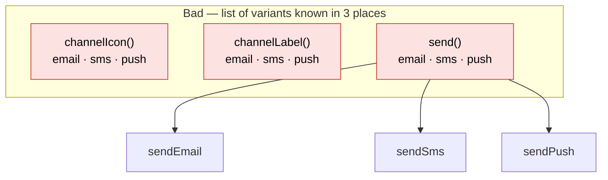
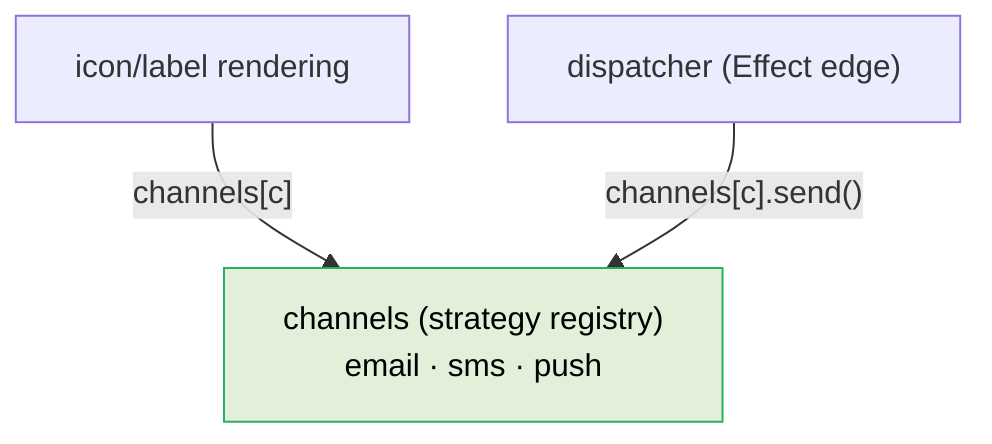

# Single Choice

> Whenever a software system must support a set of alternatives, one and only one module should know their exhaustive list.
> — Bertrand Meyer, *Object-Oriented Software Construction*

[Readiness for Change](01-readiness-for-change.md) lists "a discriminator branched on in N places" as one of the four causes of change amplification, and [Where Does This Go?](03-where-does-this-go.md) checks for it. This principle is the home those two point to — so the rule itself obeys Single Choice instead of being scattered across the doc.

The shape it governs: a `type` / `status` / `role` / `kind` discriminator — a closed set of **variants** — that drives behavior. The question is never "is this `switch`/`if` ugly?" It is: **how many places know the list of variants, and what happens when I add one?**

## The failure has names

When the answer is "many places," you have a smell the literature already named, from three angles:

- **Repeated Switches** (Fowler, *Refactoring*, 2nd ed.) — the *same* switching logic appears in multiple places, so a new case means finding and updating all of them. Note the history: the 1st edition called the smell "Switch Statements" — a blanket suspicion of the keyword. Fowler **renamed** it once pattern matching and polymorphism were widespread, because the defect was never the keyword; it was the *repetition*. Our dialects encode exactly that correction (see below).
- **Shotgun Surgery** (Fowler) — the same fault from the change's point of view: one conceptual change forces many small edits across the codebase. This is [change amplification](01-readiness-for-change.md) under another name. It is the recognizable *symptom*; Single Choice and Repeated Switches are the precise *cause*.
- **Open/Closed violation** (Meyer; Martin) — adding a variant requires *modifying* existing code at every branch site, instead of *adding* one new unit. Closed-for-modification is exactly what scatter breaks.

Informally we call this **scatter**, and our `strategy-drift` tooling names the structural form "one domain concept split across parallel lookups." Those are our shorthands for the named smells above — reach for the established names when you argue the case, so it reads as consensus rather than house preference.

## It is also a dependency problem

Scatter is not only about edit count. Robert Martin (*If/Else and Switch*, 2021) makes the architectural case: proliferated `if/else/switch` statements "tend to have cases that point outwards towards lower level modules," turning them into **dependency magnets** that bind high-level policy to low-level detail and pull the system toward a monolith. His test is sharp: *the decision about which case to follow must have been made before the high-level policy modules invoked the abstraction.*

In our terms, case-selection is an [Effect-edge](02-layers.md) concern that happens **once, at a boundary**; the high-level core must not re-branch on the same discriminator. Single Choice and the [dependency rule](02-layers.md) are the same discipline seen from two sides — which is why this principle sits next to Layers, not off on its own.

## The trigger

Apply Single Choice the moment **either** is true:

- The **same discriminator drives behavior in three or more places.** Three is the line where "I'll just inline it" stops being honest: you are now maintaining an invariant — *every site handles every variant* — that nothing enforces.
- A branch on a discriminator **reaches outward** to a lower-level module or vendor detail (Martin's dependency magnet) — even if it is the only one.

Below that line, a single, local, value-producing branch that maps an input to an output is fine. Do not pre-abstract a decision that lives in exactly one place and will stay there; that is its own change-surface cost.

## The fix

Give the set of variants **one home**, with *everything known about a variant in one place*:

- Model the variants as a single **strategy / registry** keyed by the discriminator — one entry per variant, each entry holding all of that variant's behavior (its label, its icon, its handler — whatever the call sites needed). This is *Replace Conditional with Polymorphism* (Fowler) / the *Strategy* pattern (GoF), most often realized here as data.
- Consuming code stops branching: it resolves the entry and uses it. Adding a variant becomes **adding one entry** — open for extension, closed for modification — and a single missing key (or a compiler exhaustiveness check) tells you if you forgot the behavior, instead of N silent half-updates.
- Make the selection **once, at the boundary**, so the core depends on the strategy's interface, not on the discriminator.

## What this is *not*

This principle is about *the list of variants having one owner*, not about banning a keyword. A single isolated mapping is not a violation. This is the one place the dialects legitimately **diverge in spelling**:

- The [TypeScript dialect](../dialects/typescript.md#strategy-over-branching) bans `switch` outright, because a JS `switch` is a fallthrough-prone statement that buys nothing a `Record` lookup doesn't — so the cheapest way to prevent scatter is to never start one.
- The [C# dialect](../dialects/csharp.md) *blesses* the `switch` expression for a single localized decision, because it is an exhaustive, arm-based expression with no fallthrough — but holds the **same** trigger: three `switch` expressions on one `enum` is the same Single Choice violation as three in TypeScript, and collapses to the same strategy.

Same principle, opposite keyword verdict — which is the entire reason dialects exist. If a dialect's `switch` rule ever feels like dogma, trace it back here: the target is the *single owner of the variant list*, and each language picks the spelling that best protects it.

## Reviewer checklist

- [ ] Does a discriminator (`type`, `status`, `role`, `kind`) drive behavior in three or more places? → consolidate into one strategy keyed by it.
- [ ] Is the exhaustive list of variants knowable in more than one module? → one of them is wrong; there should be a single owner.
- [ ] Does a branch select a case and then reach *outward* to a lower-level module? → dependency magnet; make the choice once at the boundary and depend on an abstraction.
- [ ] When you add a variant, how many files must change? If the answer is more than "one entry," the variants are not in one home yet.

## Examples

A notification `channel` — `email | sms | push` — drives behavior. The question is not whether the branch is ugly; it is *how many places know the list of channels.*

**Bad — the discriminator is branched on in three places.** The icon, the label, and the send logic each re-list the variants. The invariant "every site handles every channel" is real but unenforced: add a fourth channel and you must find all three sites, and a missed one is not a crash — it is a notification that renders with a blank icon or silently never sends. Note the dialects diverge in *spelling* but share the defect: TypeScript scatters object/`else if` branches, C# scatters `switch` expressions on one `enum`.

<CodeToggle>
<template #ts>

```typescript
const channelIcon = (channel: Channel) =>
  channel === 'email'
    ? 'mail'
    : channel === 'sms'
      ? 'message-circle'
      : 'bell'

const channelLabel = (channel: Channel) =>
  channel === 'email'
    ? 'Email'
    : channel === 'sms'
      ? 'Text message'
      : 'Push notification'

const send = (channel: Channel, notification: Notification) =>
  channel === 'email'
    ? sendEmail(notification)
    : channel === 'sms'
      ? sendSms(notification)
      : sendPush(notification)
```

</template>
<template #csharp>

```csharp
// three switch expressions on one enum — the same Single Choice violation
public static string Icon(Channel channel) => channel switch
{
    Channel.Email => "mail",
    Channel.Sms   => "message-circle",
    Channel.Push  => "bell",
};

public static string Label(Channel channel) => channel switch
{
    Channel.Email => "Email",
    Channel.Sms   => "Text message",
    Channel.Push  => "Push notification",
};

public static Task Send(Channel channel, Notification notification) => channel switch
{
    Channel.Email => SendEmail(notification),
    Channel.Sms   => SendSms(notification),
    Channel.Push  => SendPush(notification),
};
```

</template>
</CodeToggle>

Three modules each independently know the full list of channels, and each branch "points outward" to a low-level sender — the dependency-magnet shape from [the dependency section](#it-is-also-a-dependency-problem):



**Good — one home for the variant list.** Everything known about a channel lives in one entry. Consuming code resolves the entry and uses it; it never branches on `channel` again. Adding a channel is **one new entry**, and a missing key (or, in C#, the compiler's exhaustiveness check at the single dictionary) tells you immediately if you forgot the behavior.

<CodeToggle>
<template #ts>

```typescript
interface ChannelStrategy {
  icon: string
  label: string
  send: (notification: Notification) => Promise<void>
}

const channels: Record<Channel, ChannelStrategy> = {
  email: {
    icon: 'mail',
    label: 'Email',
    send: (notification) => sendEmail(notification),
  },
  sms: {
    icon: 'message-circle',
    label: 'Text message',
    send: (notification) => sendSms(notification),
  },
  push: {
    icon: 'bell',
    label: 'Push notification',
    send: (notification) => sendPush(notification),
  },
}
```

</template>
<template #csharp>

```csharp
public sealed record ChannelStrategy(
    string Icon,
    string Label,
    Func<Notification, Task> Send);

public static class Channels
{
    public static readonly FrozenDictionary<Channel, ChannelStrategy> Strategies =
        new Dictionary<Channel, ChannelStrategy>
        {
            [Channel.Email] = new("mail", "Email", SendEmail),
            [Channel.Sms]   = new("message-circle", "Text message", SendSms),
            [Channel.Push]  = new("bell", "Push notification", SendPush),
        }.ToFrozenDictionary();
}
```

</template>
</CodeToggle>

Now the consumers resolve one entry; the variant list has a single owner and the selection happens once, at the boundary:



### Worked scenario: adding a "webhook" channel

Marketing asks for a fourth channel, `webhook`. This single conceptual change is the test, and the diff sizes tell the whole story.

In the **scattered** shape it is **shotgun surgery** — three edits across three functions, and nothing fails loudly if you forget one:

<CodeToggle>
<template #csharp>

```diff
  public static string Icon(Channel channel) => channel switch {
      Channel.Email => "mail", Channel.Sms => "message-circle", Channel.Push => "bell",
+     Channel.Webhook => "webhook",
  };
  public static string Label(Channel channel) => channel switch {
      Channel.Email => "Email", Channel.Sms => "Text message", Channel.Push => "Push notification",
+     Channel.Webhook => "Webhook",
  };
  public static Task Send(Channel channel, Notification n) => channel switch {
      Channel.Email => SendEmail(n), Channel.Sms => SendSms(n), Channel.Push => SendPush(n),
+     Channel.Webhook => PostWebhook(n),   // ← forget this arm and it won't compile (C#'s safety net);
  };                                        //   in TS the ternary silently falls through to push
```

</template>
<template #ts>

```diff
  const channelIcon = (channel: Channel) =>
-   channel === 'email' ? 'mail' : channel === 'sms' ? 'message-circle' : 'bell'
+   channel === 'email' ? 'mail' : channel === 'sms' ? 'message-circle'
+     : channel === 'webhook' ? 'webhook' : 'bell'
  // …and the same surgery again in channelLabel…
  const send = (channel: Channel, notification: Notification) =>
-   channel === 'email' ? sendEmail(notification) : channel === 'sms' ? sendSms(notification) : sendPush(notification)
+   channel === 'email' ? sendEmail(notification) : channel === 'sms' ? sendSms(notification)
+     : channel === 'webhook' ? postWebhook(notification) : sendPush(notification)
  // ← forget the send branch and a webhook silently falls through to sendPush
```

</template>
</CodeToggle>

In the **consolidated** shape it is **one new entry**, open for extension and closed for modification; the consuming code (`channels[channel].send(notification)`) never changes because it never branched:

<CodeToggle>
<template #csharp>

```diff
  new Dictionary<Channel, ChannelStrategy>
  {
      [Channel.Email] = new("mail", "Email", SendEmail),
      [Channel.Sms]   = new("message-circle", "Text message", SendSms),
      [Channel.Push]  = new("bell", "Push notification", SendPush),
+     [Channel.Webhook] = new("webhook", "Webhook", PostWebhook),
  }.ToFrozenDictionary();
```

</template>
<template #ts>

```diff
  const channels: Record<Channel, ChannelStrategy> = {
    email: { icon: 'mail', label: 'Email', send: sendEmail },
    sms: { icon: 'message-circle', label: 'Text message', send: sendSms },
    push: { icon: 'bell', label: 'Push notification', send: sendPush },
+   webhook: { icon: 'webhook', label: 'Webhook', send: postWebhook },
  }
```

</template>
</CodeToggle>

The selection happens **once, at the boundary**: the [Effect edge](02-layers.md) resolves the strategy and the core depends only on the `ChannelStrategy` interface, not on the `channel` discriminator. That is why Single Choice and the [dependency rule](02-layers.md) are the same discipline from two sides — the variant list has one owner, and the case-selection happens once instead of leaking into every layer that touches a notification.

## Where to go next

- [Layers](02-layers.md) — why the choice belongs at the boundary, and the dependency rule it protects.
- [Information hiding](04-information-hiding.md) — a strategy object *is* a hidden decision; name it for what it decides, not the mechanism.
- Dialects: [TypeScript](../dialects/typescript.md#strategy-over-branching) · [C#](../dialects/csharp.md) — the per-language spelling of this principle.
